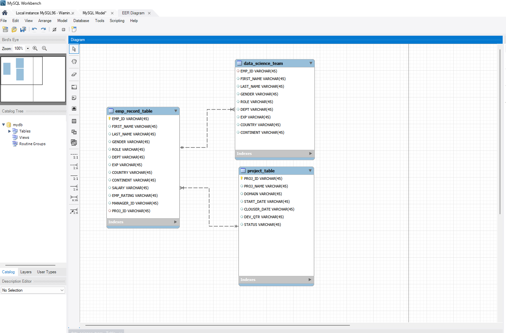

# Employee Performance and Database Reporting for ScienceQtech

**Company:** ScienceQtech
**Department Request:** Human Resources and Management
**Tools:** MySQL, MySQL Workbench

> **A note on the data:** the data used in this project is a training dataset representing a fictional data science startup called ScienceQtech. It is not real company data, and is used here purely to demonstrate SQL skills against a realistic HR and project management scenario.

---

## Datasets Provided

* [data_science_team.csv](Datasets/data_science_team.csv), thirteen rows covering employees on the data science team specifically
* [proj_table.csv](Datasets/proj_table.csv), six projects the company has worked on
* [emp_record_table.csv](Datasets/emp_record_table.csv), nineteen rows covering every employee across the whole company
* [ScienceQtechproject.md](ScienceQtechproject.md), every task in this project written out in order, each one its own section with its own query, and linked directly from the SQL Query column in the table below

---

## Problem Scenario

ScienceQtech is a rapidly growing startup operating in the data science domain, working on high impact projects such as fraud detection, market basket analysis, self driving cars, supply chain management, algorithmic early detection of lung cancer, customer sentiment analysis and the drug discovery field. With the annual appraisal cycle approaching, the HR department has requested help analysing the employee database, so that comprehensive reports covering employee performance, salary insights and project participation can be generated.

## Goal

This project automates key HR insights through SQL queries and stored logic, supporting better data driven decisions during the appraisal cycle. The work here directly feeds into performance mapping, compensation reviews, training allocation and workforce planning, ultimately contributing to the overall performance, fairness and productivity of ScienceQtech.

---

## Tasks to be Performed

| Task | Task Description | SQL Query | Result CSV |
|------|-------------------|-----------|------------|
| Task 1 | Basic employee details | [Query](ScienceQtechproject.md#task-1-basic-employee-details) | [View Result](Results/task_1_basic_employee_details.csv) |
| Task 2 | Filter employees by rating | [Query](ScienceQtechproject.md#task-2-filter-employees-by-rating) | [View Result](Results/task_2_filter_employees_by_rating.csv) |
| Task 3 | Concatenate FIRST_NAME + LAST_NAME | [Query](ScienceQtechproject.md#task-3-concatenate-first_name-and-last_name) | [View Result](Results/task_3_concatenate_name_finance.csv) |
| Task 4 | Employees who have reporters | [Query](ScienceQtechproject.md#task-4-employees-who-have-reporters) | [View Result](Results/task_4_employees_who_have_reporters.csv) |
| Task 5 | Finance and Healthcare employees, UNION | [Query](ScienceQtechproject.md#task-5-finance-and-healthcare-employees-union) | [View Result](Results/task_5_finance_healthcare_union.csv) |
| Task 6 | Max rating per department | [Query](ScienceQtechproject.md#task-6-max-rating-per-department) | [View Result](Results/task_6_max_rating_per_department.csv) |
| Task 7 | Min and max salary per role | [Query](ScienceQtechproject.md#task-7-min-and-max-salary-per-role) | [View Result](Results/task_7_min_max_salary_per_role.csv) |
| Task 8 | Rank employees by experience | [Query](ScienceQtechproject.md#task-8-rank-employees-by-experience) | [View Result](Results/task_8_rank_employees_by_experience.csv) |
| Task 9 | View for employees with salary above 6000 | [Query](ScienceQtechproject.md#task-9-view-for-employees-with-salary-above-6000) | [View Result](Results/task_9_view_salary_above_6000.csv) |
| Task 10 | Nested query, experience above 10 years | [Query](ScienceQtechproject.md#task-10-nested-query-experience-above-10-years) | [View Result](Results/task_10_nested_query_exp_above_10.csv) |
| Task 11 | Stored procedure, experience above 3 years | [Query](ScienceQtechproject.md#task-11-stored-procedure-experience-above-3-years) | [View Result](Results/task_11_stored_procedure_exp_above_3.csv) |
| Task 12 | Stored function, data science profile validation | [Query](ScienceQtechproject.md#task-12-stored-function-data-science-profile-validation) | [View Result](Results/task_12_stored_function_profile_validation.csv) |
| Task 13 | Index creation for optimisation | [Query](ScienceQtechproject.md#task-13-index-creation-for-optimisation) | [View Result](Results/task_13_index_creation_for_optimisation.csv) |
| Task 14 | Bonus calculation, five per cent times rating | [Query](ScienceQtechproject.md#task-14-bonus-calculation-five-per-cent-times-rating) | [View Result](Results/task_14_bonus_calculation.csv) |
| Task 15 | Average salary by continent and country | [Query](ScienceQtechproject.md#task-15-average-salary-by-continent-and-country) | [View Result](Results/task_15_average_salary_by_continent_country.csv) |

---

---

> Every query in this project was run against a real MySQL compatible database, loaded with the three CSV files above, rather than only written and assumed to work. Every result file in the Results folder is genuine query output, not a manually typed example.

## What Each Task Actually Does

A short, plain English explanation of each task, beyond just the query itself.

**Task 1, Basic employee details.** A straightforward column selection giving HR a clean list of every employee and which department they sit in, without the extra columns not relevant to this request.

**Task 2, Filter employees by rating.** A single query using EMP_RATING <=2 OR EMP_RATING >=4, pulling out everyone at the two extremes, the lower performers and the higher performers, in one result set rather than three separate lists. That is exactly the segmentation HR needs before an appraisal cycle, to see who needs support and who deserves recognition side by side.

**Task 3, Concatenate FIRST_NAME and LAST_NAME.** Joins first and last name into a single readable NAME column for the Finance department, small but a genuinely tidier output than two separate columns.

**Task 4, Employees who have reporters.** Groups the employee table by MANAGER_ID and counts how many employee IDs fall under each one, filtering out anyone with no manager listed at all. This gives the number of direct reports for every manager, including Arthur Black, the President, who has five people reporting to him directly, the most of anyone at ScienceQtech.

**Task 5, Finance and Healthcare employees, UNION.** Stacks the results of two separate SELECT statements into one list, combining both departments without a more complicated OR condition.

**Task 6, Max rating per department.** A window function calculates the highest rating within each department without collapsing every other column down to one row per department, so each employee's own rating can be compared directly against their department's top performer.

**Task 7, Min and max salary per role.** A simple aggregation giving the salary range for every role across the company, a natural first step for any pay equity or benchmarking exercise.

**Task 8, Rank employees by experience.** RANK gives every employee a position based on years of experience, with ties sharing the same rank, useful for seniority based decisions such as who gets first refusal on a new project.

**Task 9, View for employees with salary above 6000.** A view saves this filtered query permanently as something that behaves like a table, so HR can query it going forward without needing to remember or rewrite the underlying SQL.

**Task 10, Nested query, experience above 10 years.** A query written inside another query, first working out which employee IDs have more than ten years of experience, then pulling the full record for each. The brief specifically called for a nested approach here, a common building block for more complex logic later on.

**Task 11, Stored procedure, experience above 3 years.** Packages a query up as a named, reusable object inside the database itself, so HR simply runs CALL GetExperiencedEmployees() rather than rewriting the underlying SQL each time.

**Task 12, Stored function, data science profile validation.** Unlike a stored procedure, a stored function returns a single value and can sit directly inside a SELECT statement. This one takes an employee's years of experience and returns what their job title should be under ScienceQtech's own standard, run against the whole data science team to flag any mismatch between someone's actual role and what their experience says it should be. Running it against the real data here, every single member of the data science team already holds the correct title for their experience level, a clean, genuinely reassuring result for HR.

**Task 13, Index creation for optimisation.** EXPLAIN shows how MySQL intends to run a query before running it. Run against the real database here, it confirms the theory directly, before the index, MySQL scans all nineteen rows in the table with type ALL, after adding an index on FIRST_NAME, the same query drops to scanning a single row with type ref, a measurable performance improvement rather than a theoretical one. The result file shows both EXPLAIN outputs side by side for comparison.

**Task 14, Bonus calculation.** Applies the agreed formula, five per cent of salary multiplied by rating, to every employee at once, giving HR the exact bonus cost for the whole organisation in a single result rather than a spreadsheet built by hand.

**Task 15, Average salary by continent and country.** Grouping by two columns at once gives a proper breakdown of average pay by country nested within continent, useful for spotting regional pay differences a single flat average would hide completely.

---

## Entity Relationship Diagram

The employee record table sits at the centre of the model. It links to the project table through PROJ_ID, showing which project each employee is or was working on, and it links to itself through MANAGER_ID, since a manager is simply another employee in the same table. That second relationship is what makes the reporting structure question above possible at all.

---

## Why I Built This Project

I am building a portfolio to apply for data and database roles in the UK, and this project was the clearest way to prove genuine, hands on SQL ability rather than just listing it as a skill on a CV. Every task here maps to a real business question a junior database administrator would actually be asked to solve, filtering and ranking employees, working out reporting lines, calculating bonus costs, and proving that an index actually speeds a query up rather than just saying it should. Splitting every task into its own query file and its own result file, rather than one long document, means anyone reviewing this repository can click straight into the specific piece of work they care about.

## Skills This Project Demonstrates

* Relational database design, including a self referencing relationship for manager and reporting data
* Core SQL, filtering, sorting, grouping, aggregating and string functions
* Set based operations such as UNION, and grouping with conditional filters
* Window functions for ranking and department level comparisons
* Views, stored procedures and stored functions as reusable database objects
* Query performance analysis using EXPLAIN, and using an index to demonstrably improve it
* Translating a plain English business question into correct, working SQL, and validating the result against the real data rather than assuming it is correct

## Acknowledgements

The dataset, problem statement and business scenario for this project were provided as part of a structured SQL training course. All SQL queries, the entity relationship model and this write up are my own work.

## Contact

**Sana Aziz**

Data Analyst | SQL • Excel • Power BI • Tableau • Python

London, UK

